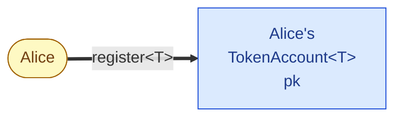
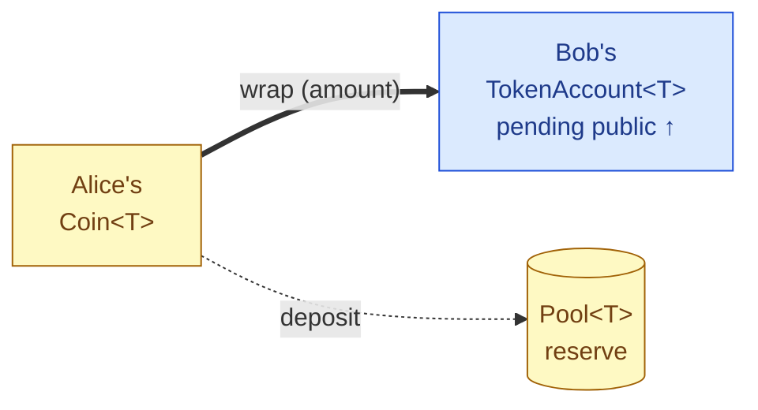
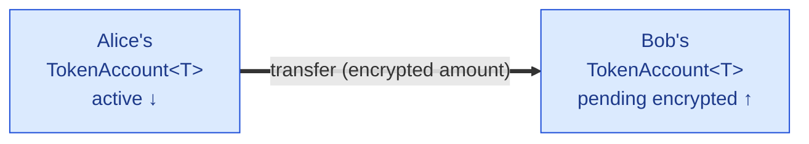
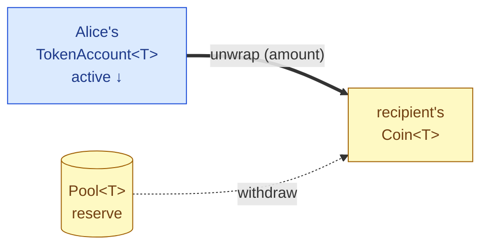

# Confidential Transfers on Sui

> **Disclaimer:** The code in this repository is still a work in progress and is not final. It has not been audited and should not be used in production.

Confidential token transfers on the [Sui](https://sui.io) blockchain. Balances and transfer amounts stay hidden using **Twisted ElGamal** homomorphic encryption and **zero-knowledge proofs**, while the network still validates that every transaction is correct. The full protocol is described in the [draft specification (v0.1)](docs/SuiConfTx.v0.1.pdf), including the formal security model and proofs.

- **Privacy** -- token balances and transfer amounts are encrypted on-chain; only the account holder can decrypt them.
- **Correctness without trust** -- zero-knowledge proofs guarantee that encrypted operations are valid (no overdrafts, no inflation) without revealing the underlying values.
- **Composability** -- any Sui `Coin<T>` can be wrapped into a confidential token and unwrapped back, so the system layers on top of existing token standards.
- **Compliance ready** -- issuers can attach an auditor key so a designated party can decrypt the amount of every transfer for oversight, and retain freeze and seize controls to pause accounts or recover funds when required. Also, an account holder can produce a zero-knowledge proof of their balance, or of the amount of a transfer they sent or received, convincing any verifier holding their public key without exposing the private key.

> **Privacy boundary:** privacy holds for activity *inside* the confidential domain — transfers between registered accounts hide the amount, leaving only sender, receiver, and timing visible. Crossing the boundary into or out of the domain — wrapping a public `Coin<T>` in, or unwrapping back to a public `Coin<T>` — touches the public coin layer and therefore reveals the amount and counterparties of that single operation, like any other Sui coin transaction.

### Basic flows at a glance

Yellow nodes live in the public domain (amounts visible on-chain), blue nodes live in the confidential domain (amounts encrypted).

**1. Register** — one-time setup per `(user, token T)` pair. Alice creates her `TokenAccount<T>`, keyed under her account key `pk`. Registration carries no auditor data (auditing is per-transfer).



**2. Wrap** — moves value from the public coin layer into Bob's (or Alice's) confidential account. The amount is visible (it's a public `Coin<T>` deposit); the coin reserve is held in `Pool<T>`, and Bob's pending public balance is credited.



**3. Transfer** — confidential-to-confidential. Alice's active balance is debited and Bob's pending encrypted balance is credited; the amount, encrypted under both keys, never leaves the confidential domain.



**4. Unwrap** — moves value back out to the public coin layer. Alice's active balance is debited and a public `Coin<T>` of the chosen amount is paid out from `Pool<T>` to the recipient.



## Repository Structure

- **[`move/`](move/)** -- on-chain Move contracts, including:
  - **[`contra.move`](move/sources/contra.move)** -- main entry point with the high-level interfaces for both issuers and users; see the module-level doc comment at the top of the file for the full list of flows.
  - **[`twisted_elgamal.move`](move/sources/twisted_elgamal.move)** -- the Twisted ElGamal encryption scheme used on-chain.
- **[`ts-sdk/`](ts-sdk/)** -- TypeScript SDKs that mirror the Move modules:
  - **[`ContraClient`](ts-sdk/src/client.ts)** -- client SDK, including all the user flows.
  - **[`ContraAuditor`](ts-sdk/src/auditor.ts)** -- auditor SDK: decrypts a transfer's amount from its `TransferEvent` using the token's auditor key.
- **[`apps/kaisho/`](apps/kaisho/)** -- example wallet demonstrating the full user flow (including wrap, transfer, unwrap). Also includes an issuer setup page that deploys the BU test token and Contra contracts to Sui devnet or testnet, and an auditor view that uses the auditor SDK to decrypt the amounts of the token's transfers. Check out the deployed [Kaisho Wallet](https://kaisho-wallet.vercel.app/)!
- **[`apps/closed-loop/`](apps/closed-loop/)** -- example of a permissioned confidential token: a third-party token (BU) is wrapped 1:1 into a pool-backed token (pBU), with registration gated by a whitelist. Useful as a reference for B2B settlement setups among a closed group of participants who mutually trust each other to handle compliance off-chain.
- **[`apps/throttler/`](apps/throttler/)** -- example of a permissioned confidential token whose `unwrap` is delayed: calls go through a wrapper that parks the unwrapped coin in a shared `ThrottledPool` and appends a per-address pending entry; the user can `take` the coin only after a configurable `min_duration` has elapsed. The issuer can adjust the delay or overwrite any per-address queue to seize tokens. Useful as a reference for compliance flows that require a withdrawal window for review or seize.
- **[`apps/payment-channel/`](apps/payment-channel/)** -- example of **a unidirectional payment channel built on top of confidential tokens**. A `Channel<T>` shared object owns a confidential `Account` via object-owner auth (`as_object()`); the sender funds it once and signs off-chain a sequence of monotonically-increasing transfers paying a fixed receiver. The receiver settles the latest transfer as a sponsored transaction, and an inactivity timeout lets the sender reclaim the residual. Every transfer amount, the locked balance, and the sender's residual remain encrypted on chain — even from the receiver, who only learns the per-transfer amount they decrypt with their own viewing key. Bundles both the Move contract ([`payment_channel.move`](apps/payment-channel/move/payment_channel/sources/payment_channel.move)) and a TypeScript package (`sender` / `receiver` / `setup` / `deploy` / `client` modules plus an e2e test), and serves as a canonical reference for the `as_object()` auth constructor.
- **[`utils/`](utils/)** -- shared helpers for testing and interacting with Sui, used by the apps and the e2e tests.

> **AI disclaimer:** The code under `apps/` and all tests across the repository were written to some extent by LLMs.

## Encryption In Use

Confidential balances and transfer amounts are encrypted with **Twisted ElGamal** over Ristretto255. The scheme uses two generators with unknown discrete-log relationship: the standard generator `g` and a hash-to-curve derived `h`. For a public key `pk = x * g`, the encryption of a message `m` with random scalar `r` is the pair

```
c = r * g + m * h    (ciphertext)
d = r * pk           (decryption handle)
```

To decrypt with secret key `x`, the holder computes `c - d / x = m * h` and then recovers `m` by solving the discrete log `m = log_h(m * h)`. Encryptions are additively homomorphic: adding two ciphertexts component-wise yields an encryption of the sum of the plaintexts under the sum of the randomizers.

### Message in the exponent, u16 limbs

Because the message lives in the exponent, decryption requires solving a discrete log -- which is only practical for small ranges. To keep balances decryptable while still covering the full `u64` range, every amount is split into four `u16` limbs and each limb is encrypted independently:

```
amount = l0 + l1 * 2^16 + l2 * 2^32 + l3 * 2^48
```

A confidential balance is therefore four Twisted ElGamal ciphertexts. Decryption uses baby-step giant-step against a precomputed table, which makes recovering plaintexts up to ~2^32 per limb practical on commodity hardware.

### Bounded aggregation

The homomorphism lets the contract fold incoming encrypted deposits into the running encrypted balance without decrypting, but each addition can grow a limb beyond its original `u16` range. Starting from limbs of at most `2^16`, summing `k` such ciphertexts produces limbs of at most `k * 2^16`. The contract caps `k` at `2^16`, so each limb stays below `2^32` and remains decryptable from the precomputed table. This bound is tracked on-chain: after roughly `2^16` deposits without a merge, further deposits are rejected until the recipient merges the pending balance into the active one (which resets the bound).

## Balance Model

A confidential token account holds three separate balances:

| Balance | Description |
|---|---|
| **Active encrypted** | The spendable balance. All outgoing transfers and unwraps deduct from this. |
| **Pending encrypted** | Encrypted deposits received from other accounts, awaiting a merge. |
| **Pending public** | Public coin deposits (wraps), also awaiting a merge. |

Incoming deposits always go to the pending balances, never directly to the active one. This is a deliberate design choice: transfer, unwrap, and key-rotation transactions all commit to a specific snapshot of the active encrypted balance in their zero-knowledge proof, so if the active balance were modified by a concurrent deposit the proof would become invalid. Keeping deposits in a separate pending pool prevents this interference.

The account owner (indirectly) calls `merge` to fold pending deposits into the active balance when they want to spend them.

### Merge-then-spend and optimistic failure

The TS-SDK's `transfer` and `unwrap` methods default to `merge: true`, which prepends a `merge` call to the same transaction. This lets the user spend their full balance (active + pending) in one step. However, because the proof is computed from the balance the SDK observed at construction time, there is a race:

- If no deposit arrives between SDK construction and chain execution, the transaction succeeds in full.
- If a new deposit arrives in that window, the pending balance the SDK assumed is stale. The chain executes the `merge` successfully (folding the old pending into active), but then fails the transfer/unwrap proof and emits a `TryTransferFailedEvent` (or `TryUnwrapFailedEvent`) instead of aborting — leaving the user's funds intact.

In the failure case, a second attempt with `merge: false` will succeed immediately, because the previously-pending deposits have already been folded into the active balance by the first transaction's `merge` call, so the proof now only needs to match the active balance and is unaffected by any further deposits that may have arrived in the meantime.

### Key rotation

The account's key (`Account.pk`) can be rotated with `setAccountKey`. Rotation is **lazy and O(1)**: it just moves the account key and touches no balance. Each token's balance stays encrypted under its own `TokenAccount.pk` and catches up independently when the owner calls `rekeyToken` (or the `rotateKey` convenience, which merges and re-keys one token in a single PTB). A not-yet-re-keyed token is a normal, decryptable state — deposits keep landing under its current key until it is re-keyed.

> **Retain the old key until every token is re-keyed.** A not-yet-re-keyed token's balance is still encrypted under the _old_ key, and both re-keying it (the proof witness is `newSk · oldSk⁻¹`) and decrypting it require that old key. Discarding the old private key while any token is still stale makes that token's balance permanently unrecoverable. Use `ContraClient.getTokenKeys(address, tokenTypes)` to list each token's current key and whether it is stale — an old key is safe to delete only once no token still reports it.

## For Token Issuers

### Normal token flow

Issuing a token on Sui doesn't require anything specific to this project. The usual steps apply:

1. Create a Sui wallet.
2. Deploy your token `T` (a standard `Coin<T>` package).
3. Use the returned `TreasuryCap<T>` to mint supply, manage the deny list, and perform any other treasury operations.


### Enabling confidential transfers for `T`

Once `T` exists as a normal Sui coin, the issuer decides how confidential transfers are enabled for it. See [`contra.move`](move/sources/contra.move) for the full list of issuer flows. At a high level there are two options:

- **Permissionless** -- any holder of `T` can use confidential transfers freely. The issuer still retains global controls (see below) via `TreasuryCap<T>` and `ManagementCap<T>`.
- **Permissioned** -- the issuer installs a policy that gates some user flows behind the issuer's own contract (e.g., for KYC, screening, or rate limiting). 

#### Permissionless setup

1. Call [`new_confidential_token<T>`](move/sources/contra.move) with the shared `TokenRegistry` and a `&mut TreasuryCap<T>`. This creates the `ConfidentialToken<T>` object and returns a `ManagementCap<T>` to the caller.
2. Share the `ConfidentialToken<T>` via [`share_confidential_token`](move/sources/contra.move) so users can interact with it.
3. (Optional) Use the `ManagementCap<T>` to set global freeze admins who can pause the confidential token in an emergency.
4. (Optional) The issuer can always freeze accounts and seize tokens.

After this, users can register token accounts, wrap `Coin<T>` into confidential balances, transfer privately, and unwrap back to `Coin<T>` without further action from the issuer.

See [`token_issuer.ts`](ts-sdk/test/e2e/token_issuer.ts), function `init`, for an end-to-end example of the steps above.

#### Permissioned setup

In addition to the steps above, the issuer can gate selected user flows behind their own contract by calling [`set_policy`](move/sources/contra.move) on the `ConfidentialToken<T>` with a witness type `W` and the bitmap of operations (`register`, `wrap`, `unwrap`) that should become permissioned. The issuer's contract then exposes wrapper functions that authenticate the caller however it likes (KYC list, allowlist, rate limit, ...) and calls the corresponding flows.

See the [closed-loop app](apps/closed-loop/) for an example that gates `register` behind a whitelist.


## Compliance

Confidential tokens are private *by default*, but issuers retain a layered set of controls so they can meet regulatory and operational requirements without giving up that default. All of the controls below are exposed through [`contra.move`](move/sources/contra.move).

### Per-account freezing

The issuer (or anyone holding the underlying token's `DenyCapV2`) can add an address to the Sui deny list for `T`. A frozen address can no longer send or receive confidential transfers, wrap, or unwrap; removing the address from the deny list restores access.

Independently, freeze admins designated by the issuer via `ManagementCap<T>` can freeze an individual `TokenAccount<T>`, blocking it from transferring, wrapping, or unwrapping. Only the issuer (`TreasuryCap<T>`) can unfreeze an account.

Freezing only blocks future activity — it does not move any funds.

### Global pause

Two independent kill switches stop *all* activity for a confidential token, intended for incident response:

- The token's own `is_active` flag, flipped off by any of the freeze admins the issuer has designated via `ManagementCap<T>` (so a non-issuer operator can pause without holding treasury authority). Only the issuer (`TreasuryCap<T>`) can lift the pause.
- The underlying coin's deny-list global pause, controlled via the standard Sui `DenyCapV2`, which has the same effect from the layer below.

### Seizing and direct balance writes

The issuer (`TreasuryCap<T>`) can overwrite any account's encrypted balance directly, bypassing the homomorphic accounting. This is the "seize" / "burn" / "reset" lever for cases where the issuer must intervene by force — court orders, lost-key recovery, fraud reversal. Because it sidesteps normal flow, the caller is responsible for keeping the total confidential supply consistent with the public pool of `Coin<T>` (typically by pairing the write with a matching wrap/unwrap in the same transaction).

### Auditor visibility

Alongside the controls above, the issuer can register an auditor public key so a designated party can decrypt transfer amounts off-chain without participating in transactions. See [For Auditors](#for-auditors) for the onboarding model and the per-transfer auditing design.

### Selective disclosure

Independently of the auditor flow, a user may voluntarily reveal a decrypted value — a balance or the amount on a specific `TransferEvent` — alongside a zero-knowledge proof that the cleartext matches the on-chain ciphertext under their public key. The verifier checks the proof against the public key without learning the user's secret key.

### Permissioned user flows [advanced]

By default `register`, `wrap`, and `unwrap` are open to any holder of `T`. The issuer can install a policy that gates any subset of those operations behind their own contract via a witness type. The wrapper functions are then free to enforce arbitrary checks — KYC, sanctions/screening lists, allowlists, rate limits, per-user caps — before authorizing the underlying flow. Confidential transfers between already-registered accounts remain permissionless even under the strictest policy, so user-to-user privacy is unaffected. The [closed-loop app](apps/closed-loop/) is an example that gates `register` behind a whitelist.


## For Auditors

An auditor is a passive reader of transfer amounts for a given confidential token: they hold the token's auditor secret key, whose public counterpart the issuer registers on-chain, and use it off-chain to decrypt the amount of each transfer. Auditors never sign protocol transactions, and never learn a user's viewing key or standing balance.

The contract implements **per-transfer auditing**: the sender attaches an auditor-readable copy of each transfer amount (two u32-limb decryption handles plus one batched proof) to every transfer, derived from the same range-proven commitments the receiver gets. Balances stay encrypted only under the user's own key, so the same account key can be reused across tokens. See [Auditor Support in Confidential Transfers](AUDITORS.md) for the design and the alternatives considered.

### Onboarding flow

1. **Generate an auditor keypair off-chain.** The auditor generates a Twisted ElGamal keypair `(sk, pk)` over Ristretto255 and hands the **public key** to the token issuer.
2. **Issuer sets the on-chain auditor key.** The issuer calls [`update_auditor`](move/sources/contra.move) with the new `pk` (or `none` to disable auditing) and an `expiration_epoch`. There is a single current key per token — no versions and no per-user escrow. On rotation the outgoing key is retained as `previous_pk` and stays valid for transfers through `expiration_epoch`, a grace window so in-flight transfers built against the old key still verify.
3. **Initialize [`ContraAuditor`](ts-sdk/src/auditor.ts).** Construct the SDK with `{ tokenType, privateKey, table }` — the auditor secret key plus a precomputed discrete-log table (the larger `numBits` is, the faster decryption will be).

### Reading transfer amounts

Auditing is per transfer, not per account. For each [`TransferEvent`](move/sources/events.move), the auditor calls `decryptTransferAmount(encryptedAmountReceiver, auditorHandles)`: it regroups the receiver's four u16 limbs into the two u32-limb commitments (mirroring `encrypted_amount::auditor_commitments`), pairs each with the event's matching handle, and BSGS-decrypts to recover that transfer's amount. The auditor sees each transfer's amount, sender, and receiver — but never a user's viewing key or account balance.

See the auditor case in [`core_flow.test.ts`](ts-sdk/test/e2e/core_flow.test.ts) for an end-to-end example of constructing a `ContraAuditor` and decrypting a transfer amount from its `TransferEvent`.

## Status

Known gaps in the current implementation:

- **Cryptography is not finalized.** The protocol and implementations are still work in progress and should not be treated as production-ready.
- **No high-level byte-array entry points on-chain.** The Move API takes ciphertexts and proofs, for example, as already-deserialized structs, so callers currently assemble each flow as a large PTB that constructs every input piece-by-piece.
- **Client SDK is not yet designed for wallets.** `ContraClient` targets the example apps and test suites in this repo: it assumes the calling process can hold the user's viewing key directly and builds whole transactions.
- **Client SDK, no permissioned operations.** `ContraClient` only builds calls against the permissionless entry points. Wrapper calls into issuer-defined permissioned `register` / `wrap` / `unwrap` flows must currently be assembled by hand in the issuer's own client code.
- **Kaisho app stores user secrets in browser local storage.** The example wallet currently persists viewing/secret keys to local storage only; a future version will use [Seal](https://github.com/MystenLabs/seal) for managed secret storage.
- **Standalone Move package.** The contract is currently a standalone Move package; later it will be deployed as part of the protocol.
